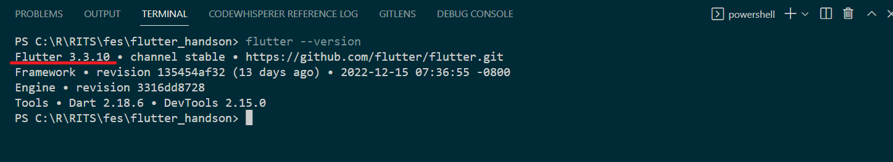

# flutter_handson

## フォルダ構成

- android/, ios/. linux/, macos/, web/, windows/: 各native固有のコード.
    - AndroidManifest.xml 等がここにあります.
- lib/: 共通のアプリコード. ここに書きます.
- test/: lib/ に対するテストコード.

## ファイル

 - pubspec.yaml: アプリバージョンや依存関係などを記述

## セットアップ
0. VSCodeをインストール
   - Extensions DartとFlutterを入れる。
1. [公式サイト](https://flutter.dev/)より「Get Started」を選択
   
2. インストールする先のOSを選択
   
   （↑の選択はWindowsの場合）
3. FlutterSDK（.zipファイル)をダウンロード
   
4. .zipファイルを解凍し、flutterフォルダを任意の場所に配置します。（例： C:\src\flutter）
   <p class="alert">**注意** 特殊文字やスペースを含むパスに配置しないでください。</p>
   <p class="alert">**注意** ProgramFilesやWindowsフォルダなど、特権の昇格権限が必要な場所に配置しないでください。</p>
   
5. パスを通す
   環境変数 Pathに flutterディレクトリの中にあったbinフォルダにパスを通します。
   
   (上記は C:\src\flutter\binの場合)
6. パスが通っていることの確認
   コマンドプロンプトを起動し以下のコマンドを実行します。
   ``` flutter --version ```
   下記のようにバージョンが表示されればOKです。
   

7.  flutter doctor
   ``` flutter doctor ```
   * 警告が表示されることがありますが今回は、Flutter,VS Code, HTTP Host Availabilityが有効（<span style="color: green; ">[√]</span>）となっていれば今回のハンズオンは進められます。（過去にFlutterを導入していない殆どの人が警告が出ると想定されます）


8. 実行
   ```flutter run -d web-server```
   を実行します。
   
   表示されたURLをクリック、あるいはブラウザで開きます。
   
   上記画面が表示されればOKです。
   ターミナルを Ctrl-C キー→Yキー押下で終了します。
   
   
----


## とりま実行

```bash
#(Windowsの場合)
$ flutter run
Multiple devices found:
Windows (desktop) • windows • windows-x64    • Microsoft Windows
Chrome (web)      • chrome  • web-javascript • Google Chrome
Edge (web)        • edge    • web-javascript • Microsoft Edge
[1]: Windows (windows)
[2]: Chrome (chrome)
[3]: Edge (edge)
Please choose one (To quit, press "q/Q"): 2
Launching lib\main.dart on Chrome in debug mode...
Waiting for connection from debug service on Chrome...　#=> Chdomeで開く
```
